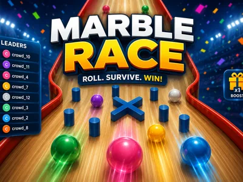
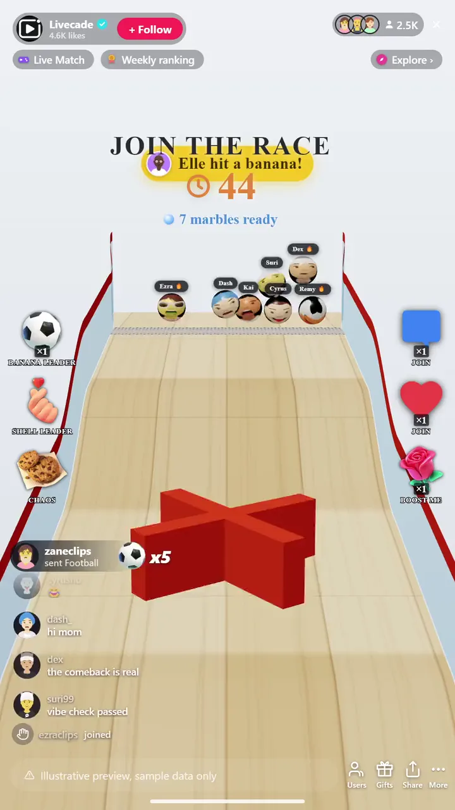

# Marble Race - Interactive TikTok Live Game

> Every viewer races their own marble down a wild 3D track.

Every viewer races as their own marble down a wild 3D track full of loops, funnels, and drops. Join with a comment, then send hazards at whoever is in front. Last marble standing wins.

**[Play Marble Race on Livecade](https://livecade.io/games/marble-race/?utm_source=github&utm_medium=readme&utm_campaign=marble-race)** - runs as a single browser source in OBS, Streamlabs, or TikTok LIVE Studio. Nothing for viewers to install.

## How viewers play

Viewers take part with the actions TikTok already gives them: **comments**, **gifts**, **likes**. Every action below is rebindable, so you decide which interaction drives which effect.

| Action | What it does |
| --- | --- |
| **Join the race** | Drops the viewer's own marble into the next race |
| **Boost my marble** | Shoves the sender's marble forward down the track |
| **Shell the leader** | Fires a homing shell at whoever is currently in the lead |
| **Banana the leader** | Drops a banana in front of the leader to trip them up |
| **Chaos (all marbles)** | Rattles every marble in the pack at once for a big-gift spectacle |

## How it works

### Join with a comment

Any comment drops the viewer's own marble into the lobby, and a like joins too. When the lobby timer ends, the whole pack rolls at once.

### Boost yourself, grief the leader

Gifts boost a viewer's own marble forward, or fire a banana or shell at whoever is in the lead. A big gift triggers Chaos and shakes the entire pack.

### Survive to the finish

Run elimination rounds that knock out the back of the field each lap, or a single race to the line. A live leaderboard tracks who is out front.

## About the game

Marble Race drops each viewer into a full 3D physics run down a chaotic track of loops, funnels and sheer drops. Viewers join with a comment, and from there the race is pure momentum.

### Help yourself or hit the leader

Send a boost to shove your own marble ahead, or fire a banana or shell at whoever is out front to knock them off the pace. A big gift triggers Chaos and rattles the whole pack at once.

### Two ways to run it

Elimination rounds that thin the field each lap, or a single dash to the line, with a live leaderboard tracking who is leading.

## What it looks like on stream

[Watch Marble Race gameplay](https://cdn.livecade.io/games/marble-race.mp4)

## What you can configure

- **Overlay language** - Twelve languages for the on-screen chrome
- **Race mode** - Elimination rounds that thin the field, or a single race
- **Eliminated per round** - How many marbles drop out at the back each round
- **Lobby length** - How long viewers have to join before the race starts
- **Max marbles** - Cap on how many marbles share the track at once
- **Leaderboard** - Show a live standings board, and how many entries

## Languages

English, Spanish, Portuguese, French, German, Italian, Indonesian, Arabic, Turkish, Russian, Hindi, Romanian

## FAQ

<strong>How do viewers join Marble Race?</strong>

Viewers join with a comment in your TikTok Live chat, and a like joins too. Each one gets their own marble in the next race, so any audience size works.

<strong>Do viewers need to send gifts to play?</strong>

No. Joining is free and comment-driven. Gifts boost a viewer's own marble or send hazards at the leader, which is what drives gifting during a race, but anyone can take part.

<strong>Can I change which gifts do what?</strong>

Yes. Every action is rebindable to a gift, comment, like, or follow with a minimum gift amount, so you decide exactly what joins, boosts, or fires a hazard.

<strong>How do I add Marble Race to my TikTok Live?</strong>

Add one browser source URL to OBS or your streaming software and go live. There is no plugin to install and nothing for your viewers to download.

## Setup

1. [Create a Livecade account](https://app.livecade.io/register?utm_source=github&utm_medium=cta&utm_campaign=marble-race)
2. Copy your overlay browser source URL
3. Paste it into OBS, Streamlabs, or TikTok LIVE Studio
4. Pick Marble Race, set your triggers, and go live

Runs in the browser, so it works on Windows and macOS with nothing to download. [See all TikTok Live games](https://livecade.io/tiktok-live-games/?utm_source=github&utm_medium=readme&utm_campaign=marble-race).

---

_This repository documents Marble Race, a hosted interactive game by [Livecade](https://livecade.io/?utm_source=github&utm_medium=footer&utm_campaign=marble-race). The game runs on Livecade's platform, so there is no source to install here._
